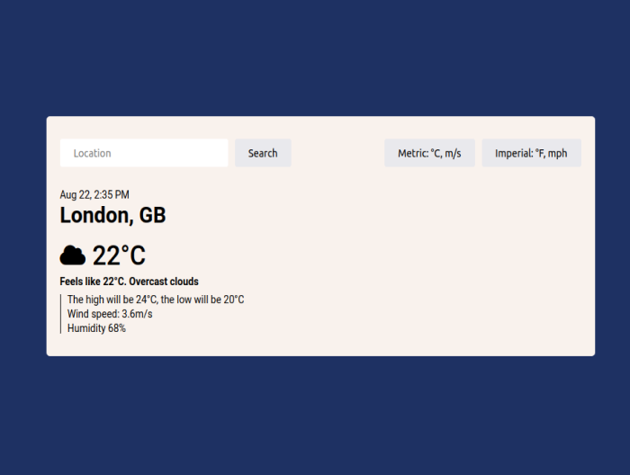

# Weather App

## Table of contents

- [Overview](#overview)
  - [About](#about)
  - [Screenshot](#screenshot)
  - [Links](#links)
- [Style Guide](#style-guide)
  - [Layout](#layout)
  - [Colors](#colors)
  - [Typography](#typography)
  - [Icons](#icons)
- [My process](#my-process)
  - [Built with](#built-with)
- [Author](#author)
## Overview
### About

Weather app that can search the weather of any city around the world. Create using [Open Weather API](https://openweathermap.org/api).
### Screenshot

### Links

- Live Site URL: [Weather App](https://gabrielojorge.github.io/weather-app/).
## Style Guide
### Layout

Responsive layout.
### Colors

- dark-blue: #1e3163;
- beige: #f9f2ed;
- grey: #d0d0d7;
- light-grey: #e9e9ed;
### Typography

- Family: [Roboto](https://fonts.google.com/specimen/Roboto);
- Weight: 400, 500, 700.
### Icons

- [Font Awesome](https://fontawesome.com/);
## My process
### Built with

- HTML5;
- CSS;
- JavaScript;
- Flexbox;
- Webpack;
- Mobile-first workflow.
## Author

- Website - [Gabriel O. Jorge](https://gabrielojorge.github.io/Portifolio/).